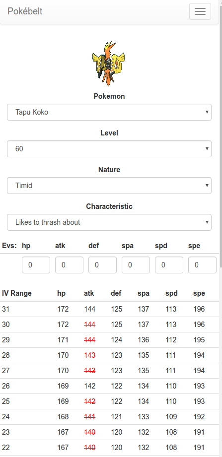
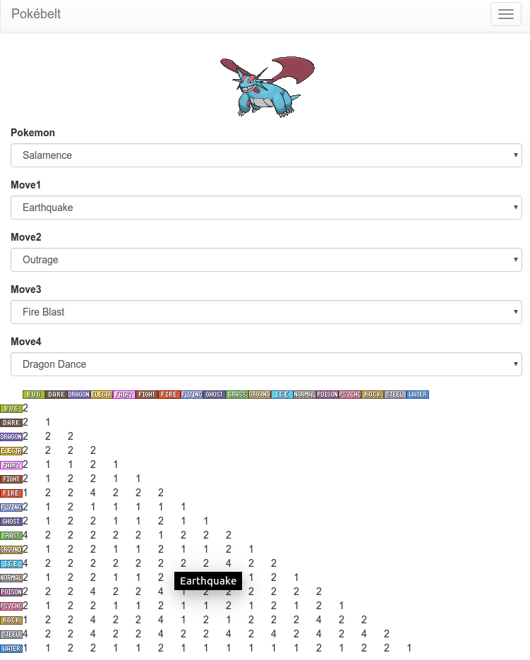

# Pokebelt

[Pokebelt](http://www.pokebelt.com) is a website focusing on very specific and niche pokemon tools. 
Recently updated to include Sun and Moon Pokemon!

## Iv Calculator

Builds a table of possible stats for each IV value.
Focused on minimizing user input! (No need to enter each stat EVERY time you reset)

## Moveset Coverage

Understanding type coverage is key to building viable competative Pokemon.
This tool shows, for a given moveset, the max effective-ness you can hit each type combo for.

## Coming soon

* Speed tables by tier
* Egg move calc

## Contributing

Any contributions in the form of a pull request are always welcome!

Specifically I struggle in the following areas-

* HTML/CSS (UI Design)
* Pokemon Data (As of writing this README there is no consistent and complete source of S/M pokemon data)

